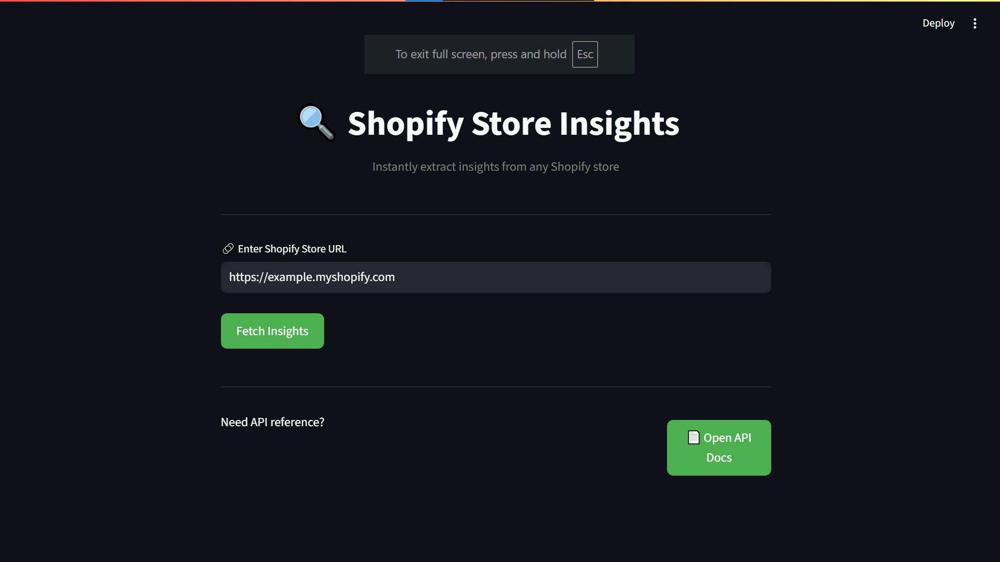
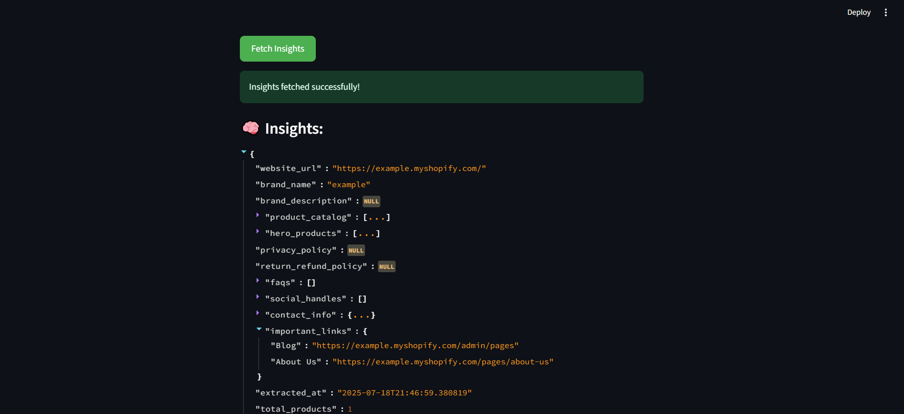

# Shopify Store Insights Fetcher

A **Streamlit + FastAPI** application to extract deep insights from any Shopify store — without using the official Shopify API.

## Features

### Core Shopify Insights

- 📦 Full Product Catalog
- 🌟 Hero/Featured Products
- 📄 Privacy & Return/Refund Policies
- ❓ Auto-extracted FAQs
- 🔗 Social Media Links (Instagram, Facebook, TikTok, etc.)
- 📧 Contact Info (emails, phones, address)
- 🧠 About the Brand (brand description, context)
- 🔍 Important Links (Track Order, Blog, Contact Us, etc.)

### 🛠 Technical Stack

- [FastAPI](https://fastapi.tiangolo.com/) backend with RESTful APIs
- [Streamlit](https://streamlit.io/) for the frontend UI
- Pydantic models for request/response validation
- Structured logging and modular codebase
- Interactive API docs (Swagger UI)

---

## Streamlit UI Preview





## Setup Instructions

### 1. Clone the Repository

```bash
git clone https://github.com/Heisenberg208/Shopify_insights_fetcher.git
cd shopify-insights-fetcher
```

---

### 2. Set Up a Virtual Environment

```bash
python -m venv venv
source venv/bin/activate
# On Windows: 
venv\Scripts\activate       
```

---

### 3. Install Dependencies

```bash
pip install -r requirements.txt
```

---

### 4. Run the FastAPI Backend

```bash
python main.py
```

- Swagger Docs: [http://127.1.0.0:8000/docs](http://127.1.0.0:8000/docs)

---

### 5. Run the Streamlit Frontend (UI)

```bash
#Note:main.py should be running in background
streamlit run streamlit_app.py
```

## Future Enhancements

### Gemini AI Integration

Use Google Gemini to:

- Summarize product catalogs or brand tone
- Auto-generate product descriptions
- Extract tone/style from FAQ and policy pages

### Visual Analytics

Display interactive charts and graphs (using `plotly` or `matplotlib`) for:

- Product price distributions
- Top product categories
- Social media presence breakdown

### Batch URL Upload

- Support uploading `.csv` or `.txt` files with multiple Shopify store URLs

- Automatically generate insights for all and display them in a structured table or dashboard

### Export to CSV / PDF

- Allow users to download the entire
  extracted insights in `.csv` or `.pdf` formats with a single click
